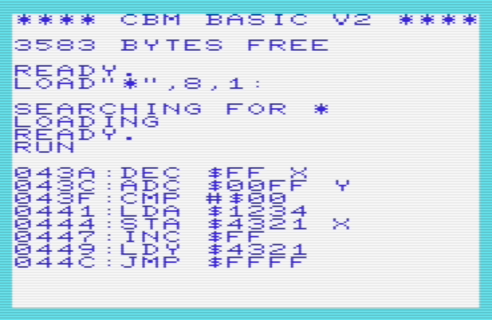

# 6502DISASSEMBLER

6502 disassembler written in 6502 ASM for a VIC-20, made for the purpose of futher learning VIC-20 computing. End goal is implementation of memory dump disassembly on programs currently loaded in VIC-20 RAM for debugging on physical VIC-20 hardware.

## 1/1/18: Added support for 0b01 set of instructions

Support for opcode dissassembly (including addressing) of
  -ORA
  -AND
  -EOR
  -ADC
  -STA
  -LDA
  -CMP
  -SBC
