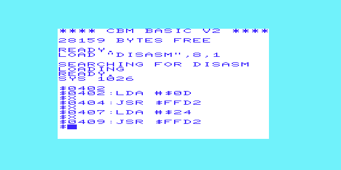

# 6502DISASSEMBLER

6502 disassembler written in 6502 ASM for a VIC-20, made for the purpose of futher learning VIC-20 computing. End goal is implementation of memory dump disassembly on programs currently loaded in VIC-20 RAM for debugging on physical VIC-20 hardware.

## 1/8/2018 CHANGELOG
-Implemented basic command-line for address entry. Location in memory is input as two hexadecimal bytes, and confirmed with the enter key
-Next instruction can be loaded and disassembled with the e(x)ecute key, and the user can return to the VIC-20 BASIC at any time with the (q)uit key
-Program must now be loaded into memory off of a floppy disk or cassette tape. The program is listed on the disk as "DISASM", and can be loaded with 'LOAD "DISASM",<drive number>,1'. To run the program afterwards, jump to the starting address it was loaded to, 0x0402

As of now, there are two bugs remaining that must be ironed out that I'm aware of at the moment. The first is the incorrect dissassembly of the indirect indexed addressing mode. The instruction and operands are disassembled and listed correctly, but they are shown as being used in indexed addressing mode. The second is certain one byte instructions being disassembled incorrectly and listed as the wrong instruction. These will be fixed in the next few days. 

